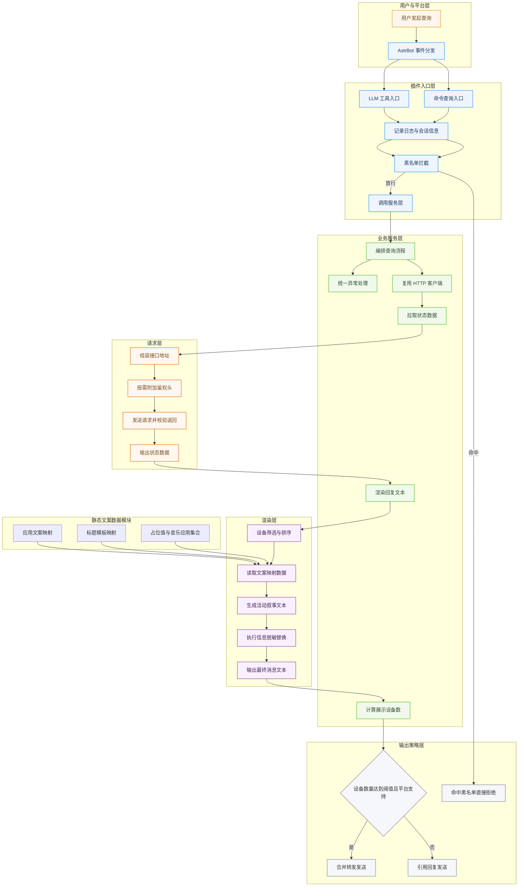

<!-- markdownlint-disable MD028 -->
<!-- markdownlint-disable MD033 -->
<!-- markdownlint-disable MD041 -->


<p align="center">
  
  
  
</p>

<p align="center">
  
  
  
</p>

<p align="center">
  
  
  
</p>

[](https://github.com/DBJD-CR/astrbot_plugin_live_dashboard)


---

一个为 [AstrBot](https://github.com/AstrBotDevs/AstrBot) 设计的「视奸面板」插件。  
用于对接上游 Live Dashboard 服务，支持在私聊/群聊中通过指令快速查询当前手机、电脑的活动状态信息。  
还支持用自然语言让 LLM 自主查询，让 Bot 和群友都能随时随地视奸你！❤️

## 📑 快速导航

- [✨ 功能特性](#-功能特性)
- [📊 输出示例](#-输出示例)
- [🚀 安装与使用](#-安装与使用)
- [📋 指令说明](#-指令说明)
- [🤖 函数工具自动调用](#-函数工具自动调用)
- [⚙️ 配置项详解](#️-配置项详解)
- [📂 插件目录与结构](#-插件目录与结构)
- [🏗️ 架构说明](#️-架构说明)
- [❓ 常见问题](#-常见问题)
- [🚧 已知限制](#-已知限制)
- [📄 许可证](#-许可证)

---
<!-- 开发者的话 -->
> **开发者的话：**
>
> 大家好，我是 DBJD-CR，这是我为 AstrBot 开发的第三个插件，如果存在做的不好的地方还请理解。
>
> 最开始是在 B 站上刷到的项目，觉得挺有意思的就部署了一下。顺便让 AstrBot 强兼了该项目，并满足一下我的“赛博露出癖”（bushi）
>
> 和我写的其他插件一样，本插件也是"Vibe Coding"的产物。
>
> 所以，**本插件的所有文件内容，全部由 AI 编写完成**，我几乎没有为该插件编写任何一行代码，仅进行了架构设计与修改部分文字描述和负责本文档的润色。所以，或许有必要添加下方的声明：

> [!WARNING]  
> 本插件和文档由 AI 生成，内容仅供参考，请仔细甄别。
>
> 插件目前仍处于开发阶段，无法 100% 保证稳定性与可用性。

> 不过，这次的开发过程还是相当顺利的，小半天就把插件搓好了，用着也挺顺手，能力提高了不少喵！
>
> 虽然这个插件功能比较简单，也还是诚邀各路大佬对本插件进行测试和改进，希望大家多多指点。
>
> 如果觉得这个插件比较好玩的话，**就为这个插件点个** 🌟 **Star** 🌟 **吧~** ，这是对我们的最大认可与鼓励！

> [!NOTE]
> 虽然本插件的开发过程中大量使用了 AI 进行辅助，但我保证所有内容都经过了我的严格审查，所有的 AI 生成声明都是形式上的。你可以放心参观本仓库和使用本插件。
>
> 目前插件的主要功能都能正常运转。但仍有很多可以优化的地方。

> [!TIP]
> 本项目的相关开发数据 (持续更新中)：
>
> 开发时长：累计 2 天（主插件部分）
>
> 累计工时：约 14 小时（主插件部分）
>
> 使用的大模型：GPT 5.4(With RooCode in VSCode)
>
> 对话窗口搭建：VSCode RooCode 扩展
>
> Tokens Used：39,210,500

---

## ✨ 功能特性

实时查询设备状态，支持通过 AstrBot 的 WebUI 进行配置，具备完善的黑白名单机制，控制回复内容，避免输出过长或泄露不希望展示的信息。

- 请求上游接口：`GET {base_url}/api/current`
- 聚合展示：
  - 在线设备数
  - 设备名 / 平台 / 在线状态
  - 当前应用名
  - 展示标题（`display_title`）
  - 电量与充电状态
  - 音乐信息
  - 最后上报时间

## 📊 输出示例

```text
📊 Live Dashboard 状态面板
在线设备：2/2
当前访客：5

• My PC [在线] (windows)
  现在：正在用VS Code写「astrbot_plugin_live_dashboard - Visual Studio Code」喵~
  应用：Visual Studio Code
  标题：astrbot_plugin_live_dashboard - Visual Studio Code
  🔋 电量：86% ⚡充电中
  🎵 音乐：Ave Mujica - KiLLKiSS (Spotify)
  🕒 上报：03-24 19:42:11

• My Phone [在线] (android)
  现在：正在B站看「推荐 - 哔哩哔哩」喵~
  应用：哔哩哔哩
  标题：推荐 - 哔哩哔哩
  🔋 电量：62% 未充电
  🎵 音乐：暂无播放
  🕒 上报：03-24 19:42:08
```

## 🚀 安装与使用

1. **下载插件**: 通过 AstrBot 的插件市场下载。或从本 GitHub 仓库的 Release 下载 `astrbot_plugin_live_dashboard` 的 `.zip` 文件，在 AstrBot WebUI 中的插件页面中选择 `从文件安装` 。
2. **安装依赖**: 本插件的核心依赖为 `httpx`，插件下载安装时会自动安装插件所需的依赖，通常无需额外安装。如果你的环境中确实缺少相关依赖，请安装：

   ```bash
   pip install httpx
   ```

3. **重启 AstrBot (可选)**: 如果插件没有正常加载或生效，可以尝试重启你的 AstrBot 程序。
4. **配置插件**: 进入 AstrBot WebUI，找到 `视奸面板` 插件，选择 `插件配置` 选项，配置相关参数：

- `base_url`（例如 `https://your-domain.com` `http://localhost:3000` `http://127.0.0.1:3000`）

若你的服务端或反向代理要求鉴权，再填写：

- `auth_token`

> [!WARNING]  
> 本插件是否能正常运行完全依赖你是否配置了相关服务，如果未配置相关 URL 并启动本地服务，插件功能将无法正常使用。
>
> 有关 Live Dashboard 的部署和本地数据上报，请参考上游项目的 [README文档](https://github.com/Monika-Dream/live-dashboard) 进行部署。

---

## 📋 指令说明

| 指令 | 别名 | 说明 |
| :-- | :-- | :-- |
| `/视奸` | `/live` `/dashboard` `/设备状态` `/状态面板` | 查询当前 Live Dashboard 状态 |

---

## 🤖 函数工具自动调用

插件内置了 LLM 函数工具，支持 Bot 通过自然语言对话“自行调用 `/视奸` 能力”。

- 工具名：`query_live_dashboard_status`
- 注册方式：`@filter.llm_tool`
- 触发引导：通过 `@filter.on_llm_request` 注入工具使用规范，提示模型在涉及“实时设备状态/现在在做什么/视奸状态”等意图时优先调用工具。

效果示例：


### 工具调用行为

1. **自动复用主查询链路**：工具与 `/视奸` 共用同一套黑名单校验、上游请求与渲染逻辑。
2. **结果可直接给 LLM 观察**：工具返回“成功/失败”文本，成功时附带完整状态面板原文；失败时返回可解释的错误原因（如未配置地址、超时、鉴权失败、网络错误等）。
3. **支持自然连续对话**：LLM 拿到工具结果后可继续按人设组织自然回答，不需要用户再次触发命令。

### 使用建议

- 若你希望 Bot 更积极地在对话中调用该工具，请确保当前会话开启了函数调用能力。
- 当 Bot 回答里出现“实时状态查询失败”时，优先检查 `base_url`、`auth_token`、网络连通性与上游服务运行状态。

## ⚙️ 配置项详解

配置 Schema 文件：[_conf_schema.json](_conf_schema.json)

### 基础连接配置

| 配置项 | 类型 | 默认值 | 说明 |
| :-- | :-- | :-- | :-- |
| `base_url` | string | `""` | Live Dashboard 服务地址（必填） |
| `auth_token` | string | `""` | 可选 Bearer Token |
| `request_timeout_sec` | int | `30` | 请求超时秒数 |

### 输出范围配置

| 配置项 | 类型 | 默认值 | 说明 |
| :-- | :-- | :-- | :-- |
| `include_offline_devices` | bool | `false` | 是否包含离线设备 |
| `max_devices` | int | `10` | 最多输出设备条数 |
| `device_whitelist_keywords` | string | `""` | 设备白名单关键词：仅展示命中设备名的设备 |
| `device_blacklist_keywords` | string | `""` | 设备黑名单关键词：命中设备名则隐藏（优先级高于白名单） |
| `group_blacklist_sessions` | string | `""` | 群组黑名单（按 `session_id` 匹配）；命中后该群会话不响应查询 |
| `user_blacklist_senders` | string | `""` | 用户黑名单（按 `sender_id` 匹配）；命中后不响应该用户查询 |
| `info_blacklist_keywords` | string | `""` | 信息黑名单关键词；命中后替换 `应用` 与 `标题` 字段文案 |
| `info_blacklist_replacement` | string | `"不想让你看到我在干什么喵~"` | 信息黑名单命中后的统一替换文案 |

> 匹配与替换规则：
>
> - 所有列表项都支持逗号 / 分号 / 换行分隔；
> - `device_whitelist_keywords`、`device_blacklist_keywords` 仅匹配 `device_name`，不区分大小写，按“子串包含”匹配；
> - `group_blacklist_sessions` 支持两种写法：完整 `session_id`（如 `GroupMessage:123456789`）或仅群号（如 `123456789`，按 `:{群号}` 后缀匹配）；
> - `user_blacklist_senders` 需填写完整 `sender_id`，如 `987654321`；
> - `info_blacklist_keywords` 不区分大小写，按“子串包含”匹配；
> - 信息黑名单作用于输出中的 `现在`、`应用` 与 `标题` 字段（统一按相同关键词与替换文案处理）。

### 输出字段开关

| 配置项 | 类型 | 默认值 | 说明 |
| :-- | :-- | :-- | :-- |
| `show_platform` | bool | `true` | 显示平台（windows/macos/android） |
| `show_app_name` | bool | `true` | 显示当前应用名 |
| `show_display_title` | bool | `true` | 显示 `display_title` |
| `show_battery` | bool | `true` | 显示电量信息 |
| `show_music` | bool | `true` | 显示音乐信息 |
| `show_last_seen` | bool | `true` | 显示最后上报时间 |
| `show_viewer_count` | bool | `false` | 显示访客数 |
| `show_server_time` | bool | `false` | 显示服务端时间 |

---

## 📂 插件目录与结构

```bash
AstrBot/
└─ data/
   └─ plugins/
      └─ astrbot_plugin_live_dashboard/
         ├─ __init__.py                      # Python 包初始化文件，支持相对导入
         ├─ .gitignore                       # Git 忽略规则
         ├─ _conf_schema.json                # AstrBot WebUI 配置界面 schema 定义
         ├─ CHANGELOG.md                     # 插件更新日志，适用于 AstrBot v4.11.2+
         ├─ CONTRIBUTING.md                  # 本插件的贡献指南
         ├─ LICENSE                          # 许可证文件
         ├─ logo.png                         # 插件 Logo，适用于 AstrBot v4.5.0+
         ├─ main.py                          # 插件主入口文件，包含命令处理
         ├─ metadata.yaml                    # 插件元数据信息
         ├─ README.md                        # 插件说明文档
         ├─ requirements.txt                 # 插件依赖列表
         ├─ run_ruff.bat                     # Ruff 一键格式化与自动修复脚本
         │
         ├─ assets/                          # README / 仓库展示资源
         │
         ├─ services/
         │    ├─ __init__.py
         │    ├─ app_descriptions.py         # 文案映射与标题模板数据
         │    ├─ dashboard_service.py        # 业务编排层
         │    ├─ message_renderer.py         # 文本渲染层
         │    └─ payload_client.py           # 上游请求层
         │
         └─ utils/
              ├─ __init__.py
              ├─ config_parser.py            # 配置解析工具
              └─ time_formatter.py           # 时间格式化工具
```

---

## 🏗️ 架构说明



### 分层职责

- `main.py`：AstrBot 接口层，负责事件与命令接入。
- `services`：业务实现层，解耦请求、渲染、异常处理；其中 `app_descriptions.py` 仅承载静态文案数据，便于维护。
- `utils`：跨模块可复用工具能力（如配置读取、列表文本解析、时间格式化）。

### 模块化代码结构

当前实现采用“入口层 / 服务层 / 工具层”分层设计：

- 入口层：只负责 AstrBot 事件接入与命令分发
- 服务层：负责请求数据、编排流程、渲染消息
- 工具层：负责配置读取、时间格式化等通用逻辑

### 健壮的异常处理

- 请求超时
- 网络不可达
- HTTP 状态异常（含 401/403）
- 返回结构不符合预期

均返回友好提示文案，并在日志中输出可排错信息。

---

## ❓ 常见问题

### Q1：回复“未配置 Live Dashboard 地址”

请在插件配置中设置 `base_url`，且不要包含尾部 `/api/current`。

### Q2：回复“鉴权失败（401/403）”

- 检查 `auth_token` 是否正确。
- 若上游 `/api/current` 未启用鉴权，`auth_token` 可留空。

### Q3：回复“网络错误 / 请求超时”

- 确认 `base_url` 可访问。
- 提高 `request_timeout_sec`。
- 检查反向代理和防火墙。

---

## 🚧 已知限制

- 当前输出格式为纯文本，尚未提供图片卡片等渲染服务。
- 当前未实现短时缓存（高频调用会直接请求上游）。
- 当前不区分会话级个性化配置（后续可按需扩展）。

## 💖 友情链接与致谢

本插件的灵感与基础服务来源于：

- [live-dashboard](https://github.com/Monika-Dream/live-dashboard)：在此感谢其开发团队对该项目的付出。

## 📚 推荐阅读

我的其他插件：

- [主动消息 (proactive_chat)](https://github.com/DBJD-CR/astrbot_plugin_proactive_chat) - 它能让你的 Bot 在特定的会话长时间没有新消息后，用一个随机的时间间隔，主动发起一次拥有上下文感知、符合人设且包含动态情绪的对话。
- [灾害预警 (disaster_warning)](https://github.com/DBJD-CR/astrbot_plugin_disaster_warning) - 它能让你的 Bot 提供实时的地震、海啸、气象预警信息推送服务。

## 🤝 贡献

欢迎提交 [Issue](https://github.com/DBJD-CR/astrbot_plugin_live_dashboard/issues) 和 [Pull Request](https://github.com/DBJD-CR/astrbot_plugin_live_dashboard/pulls) 来改进这个插件！

- 对于新功能的添加，请先通过 Issue 等方式讨论。
- 对于 PR (拉取请求)，请确保你已阅读并同意遵守本项目的 [贡献指南](https://github.com/DBJD-CR/astrbot_plugin_live_dashboard/blob/main/CONTRIBUTING.md)。

### 📞 联系我们

如果你对这个插件有任何疑问、建议或 bug 反馈，欢迎加入我的 QQ 交流群。

- **QQ 群**: 1033089808
- **群二维码**:
  
  

## 📄 许可证

GNU Affero General Public License v3.0 - 详见 [LICENSE](LICENSE) 文件。

本插件采用 AGPL v3.0 许可证，这意味着：

- 您可以自由使用、修改和分发本插件。
- 如果您在网络服务中使用本插件，必须公开源代码。
- 任何修改都必须使用相同的许可证。

## 📊 仓库状态


## ⭐️ 星星

[](https://www.star-history.com/#DBJD-CR/astrbot_plugin_live_dashboard&Date)

---

Made with ❤️ by DBJD-CR & GPT
